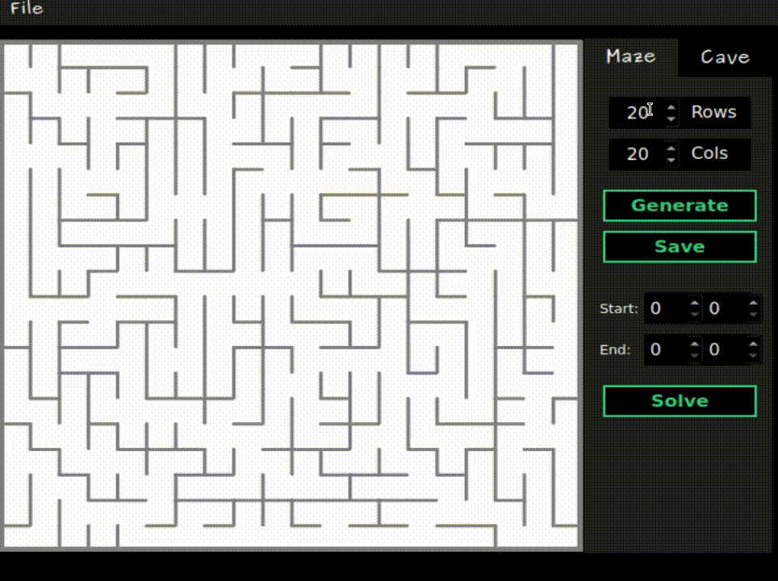
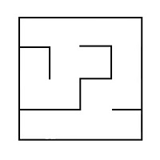

# Mazes & Caves

_Last updated March 2025_



## Introduction

This document describes how to install, run, check and remove Maze on Linux and Unix-like systems. Please note that the program was written and tested on Ubuntu 22.04 LTS, so its behaviour may differ if you use other versions or OS distributions.

## Installation & Running

### Prerequisites

Correct compilation and running of the program depends on other utilities and libraries. Check that you have their latest versions before proceeding: 

| Compilation targets | Utilities |
| ------------------- | --------- |
| App Compilation & Running | gcc, make |
| Desktop Interface | Qt5+, qmake |
| Web Interface | python or VS Code or emrun |
| Testing | GTest library |
| GCOV Report | gcov, lcov |
| Leaks Check | valgrind |
| Convert Manual to DVI | texi2dvi |

</br>

### Setup

Download or clone (git clone <link_to_repo>) the source repository to where you can easily find it. Then type and run the following commands in the terminal: 

1. `cd <path-to-git-folder>/src/maze`

2. `make install`

Now the program is compiled, placing the app in a folder named `src/build/`. The app should open automatically. If you want to open it later using command line, run make maze. If there are errors, you're likely missing some packages. Check __Prerequisites__.

If you're on Windows, you'll need to have MinGW installed. Then, you can build and run the app in Qt Creator (make sure the build directory in the settings is `src/build`).

</br>

### Formatting

The maze is stored in a file as a number of rows and columns, as well as two matrices containing the positions of vertical and horizontal walls respectively. The first matrix shows the wall to the right of each cell, and the second — the wall at the bottom. An example of such a file:
```
4 4 
0 0 0 1 
1 0 1 1 
0 1 0 1 
0 0 0 1

1 0 1 0 
0 0 1 0 
1 1 0 1 
1 1 1 1
```

The maze described in this file:




A cave that has passed 0 simulation steps (only initialized) is stored as a number of rows and columns, as well as a matrix containing the positions of 'alive' and 'dead' cells. For example:
```
4 4 
0 1 0 1 
1 0 0 1 
0 1 0 0 
0 0 1 1
```

The cave described in this file:


</br>

### Usage

The app layout should be fairly intuitive. On the first load, you'll see a horizontal __Menu Tab__ plus an __Action Tab__ on the right side of the screen. The __Menu Tab->File__ has the following options: 

1. Upload Maze — _choose .txt maze file to display_ 

2. Upload Cave — _choose .txt cave file to display_ 

3. Save Maze — _save current maze as .txt file in the format described above_

4. Exit — _close the app_

</br>

The __Action Tab__ allows you to switch between Maze and Cave, which changes the options currently available:

__> Maze__

(a) Rows & Cols Boxes — _dimensions for a maze to be generated (1 to 50)_

(b) Generate Button — _generate and display a 'perfect' mazei.e. maze without inaccessible areas or loops, where only one path exists between any two points using Eller's algorithm_

(c) Save Button — _save current maze as .txt file in the format described above_

(d) Start & End Boxes — _position of start & end points of a maze solution (row, column)_

(e) Solve Button — _solve current maze_

(f) Train Agent Button — _train agent using Q-learning method (you need to specify the end position)*_

(g) Apply Agent Button — _solve maze using the trained agent (you need to specify the start position)_

</br>

__*Note:__ the maze and end position must stay the same during the agent's training and testing stages. If they change, the agent should be trained again.

</br>

__> Cave__

(a) Rows & Cols Boxes — _dimensions for a cave to be generated (1 to 50)_

(b) Cell Initialisation (%) — _chance of individual cell in the first generation being initialised (1-99%; 50% recommended)_

(c) Generate Button — _generate and display initialised cave_

(d) Next Step — _generate next step for current cave using cellular automation (disabled when __Automode__ is on)_

(e) Birth Limit — _lower limit of 'alive' neighbours a 'dead' cell needs to be 'born' (0-7; 5 recommended)_

(f) Death Limit — _lower limit of 'alive' neighbours 'alive' cell needs to stay 'alive' (0-7; 4 recommended)_

(g) Automode Button — _enables automatic next step generation_

(h) Hold Frame For (ms) — _generate next step every N ms (40-2000, 200 recommended; disabled when __Automode__ is off)_

</br>

### Web UI

Additionally, you can use the app without installing it, through a local server. The web version of UI was built using WebAssembly and Emscripten Compiler. To open it, go to the `src/maze/web_ui` folder and then:

• Open `maze.html` using Live Server extension in VS Code, OR

• Run `[python | pyton3 | py (on Windows)] -m http.server` inside the folder (you need to have Python installed), OR

• Run `<path-to-emscripten-folder>/emrun --browser=[your browser] maze.html` (you need to have EmSDK installed)

Then go to `localhost/maze.html` address in your preferred browser. Done!


## Structure & testing

The program was made using C++20 language and standard libraries, with the interface provided by Qt. The source code can be found in `maze/backend` and `maze/frontend folders`. The backend modules can be tested with GTest: 

1. To run tests: `make test `

2. To display test coverage: `make gcov_report` 

3. To check for leaks: `make valgrind`  

Running `make` or `make all` will reinstall and compile the program. You can get DVI documentation with `make dvi` or a distribution .tar.gz package with make dist. Also note: 

1. Not every maze and cave can be displayed by the app. Check __Formatting__.

2. Example files can be found in `src/assets/example_files`.


## Deinstallation

Simply run `make uninstall`. This will remove the `src/build` directory but not the original download, which can be safely deleted afterwards.

If you wish to suggest an improvement or report a bug, contact me __@ginzburg_jake (Telegram) or JakeTheSillySnake (GitHub)__.
